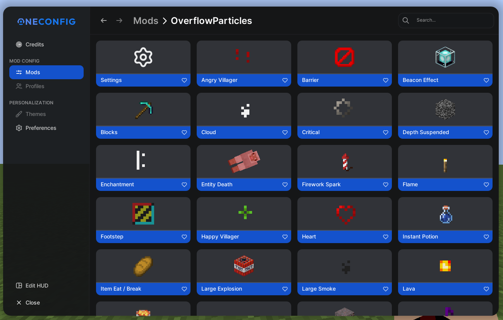
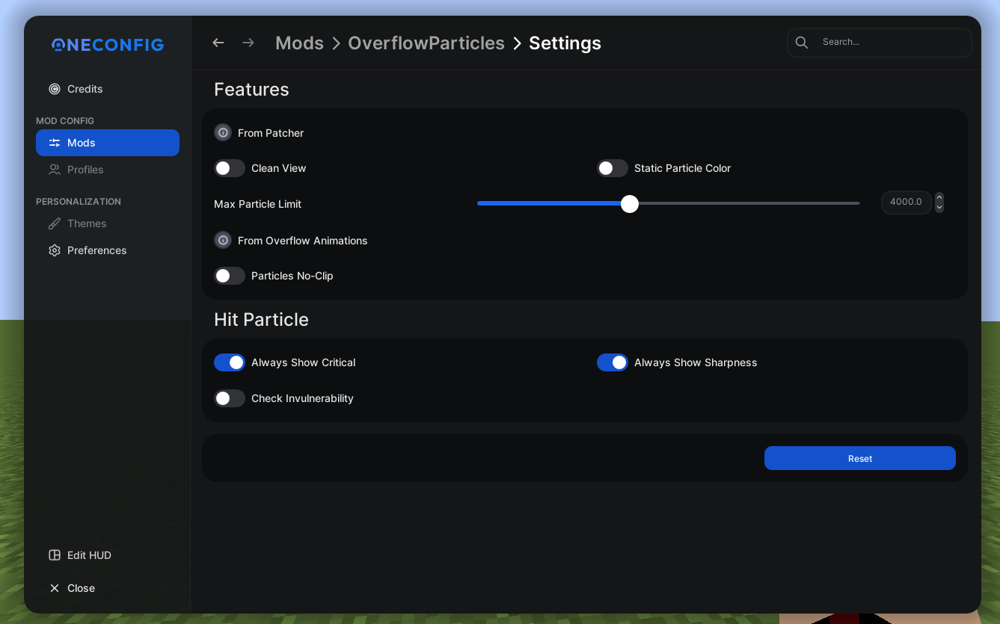
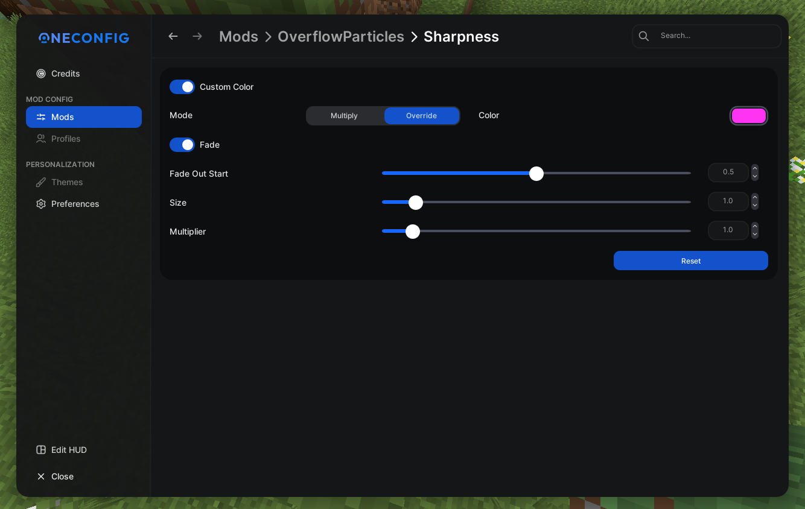

# OverflowParticles

  

Extremely precise and advanced particle mod for 1.8.9.

## Features

- Per Particle Settings
- Max Limit
- No-Clip
- Customizable Color
- Size & Amount Multiplier
- Fade Out

## Gallery

